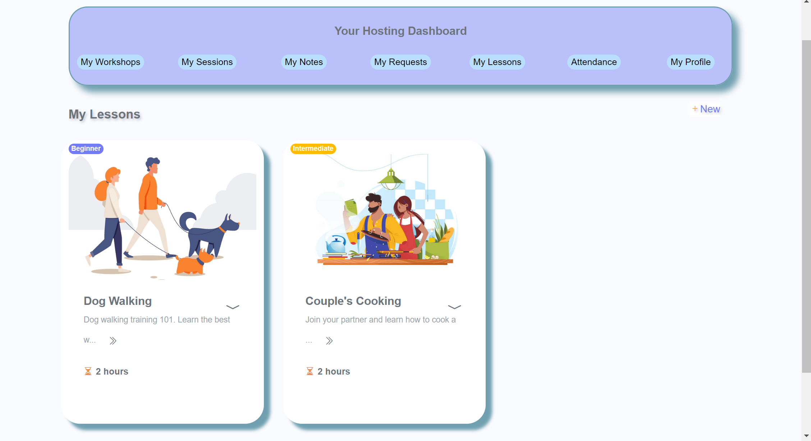
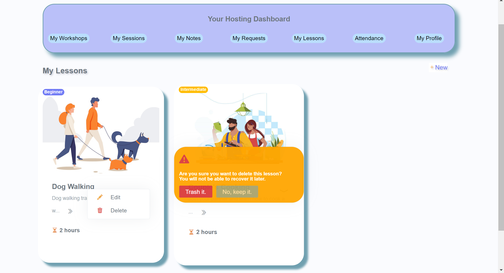
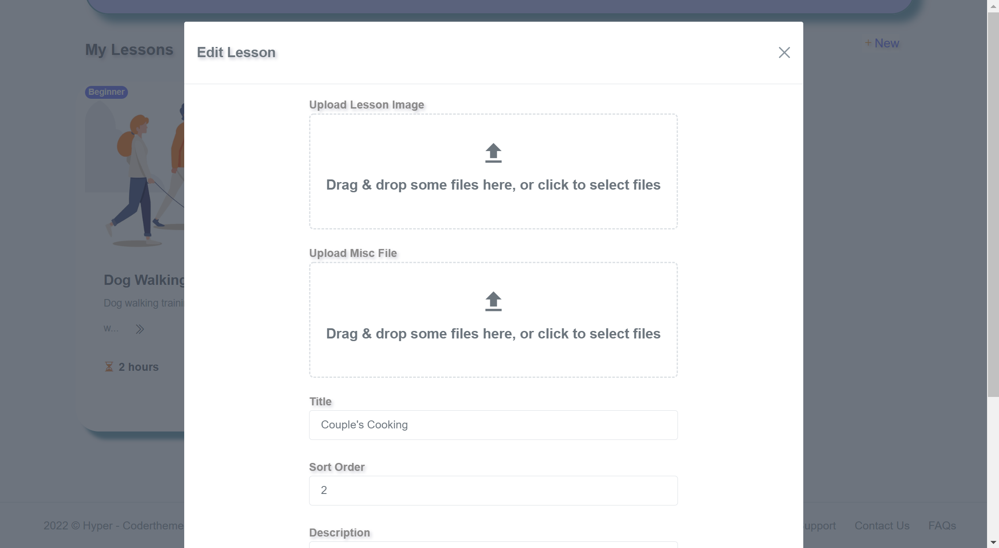
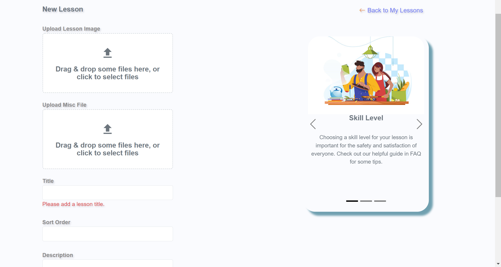
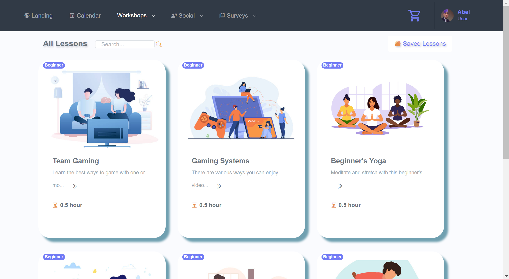
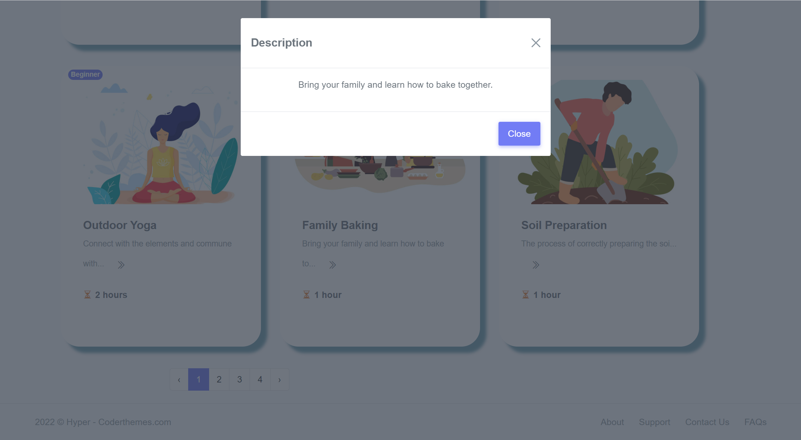

# Trainsquare
## Trainsquare is a consumer educational and skills platform based on community-sharing knowledge, which allows users to host their own in-person workshops and discover and book courses, lessons and activities.
### This repo contains sql, .net, and react code pertaining to the lessons feature I was responsible for. 

  

  

  

  

  

  

