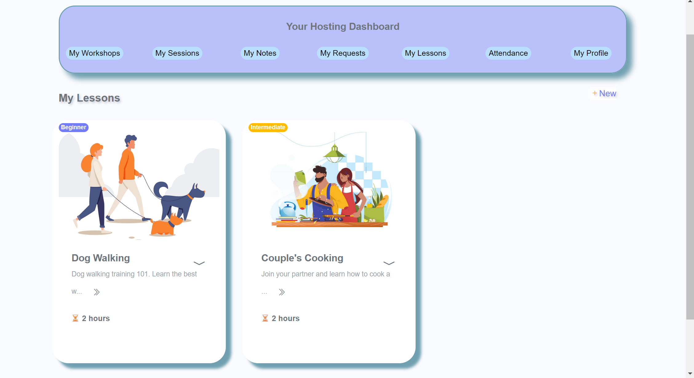
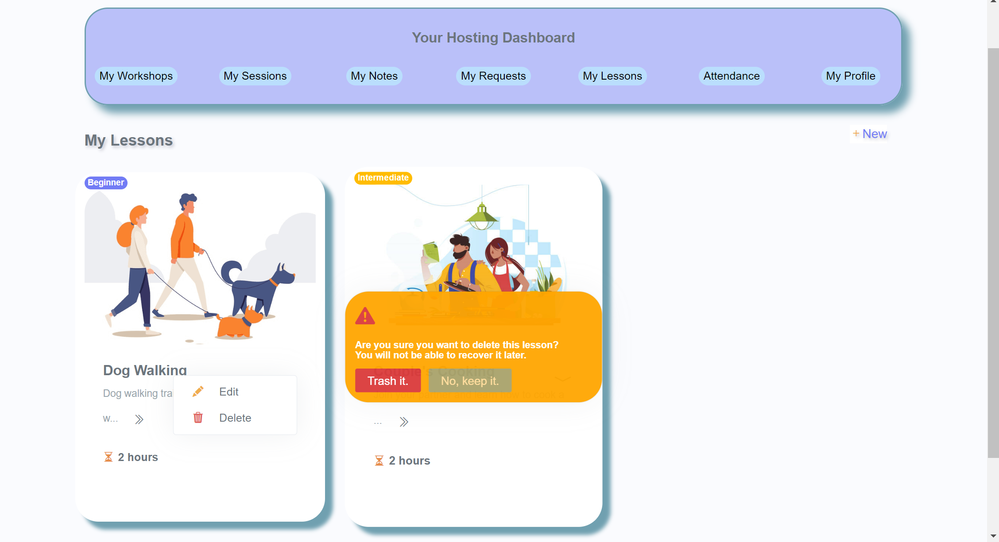
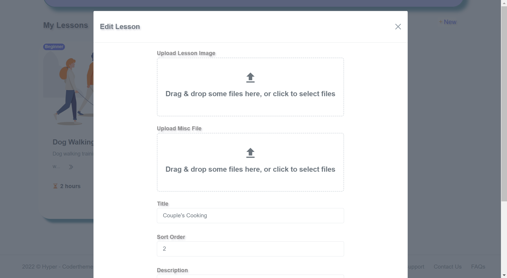
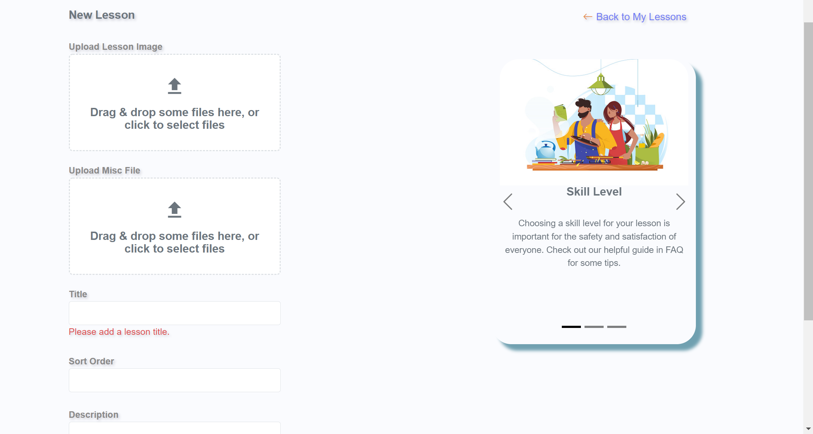
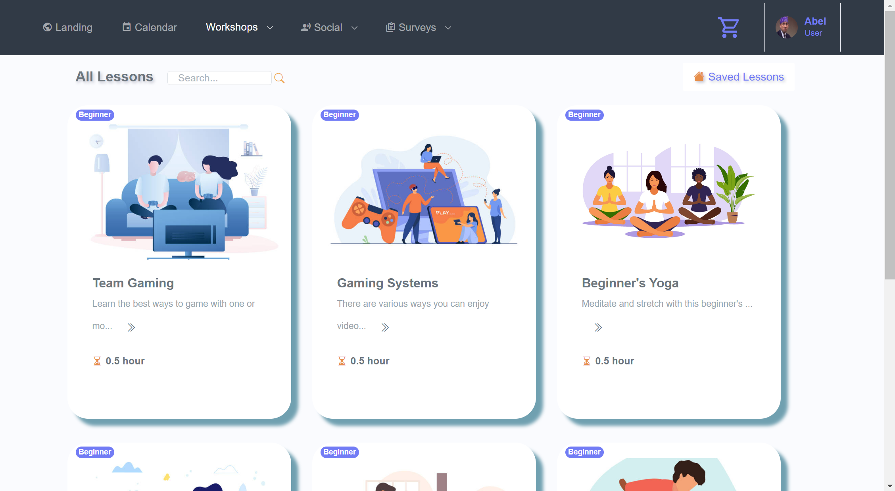
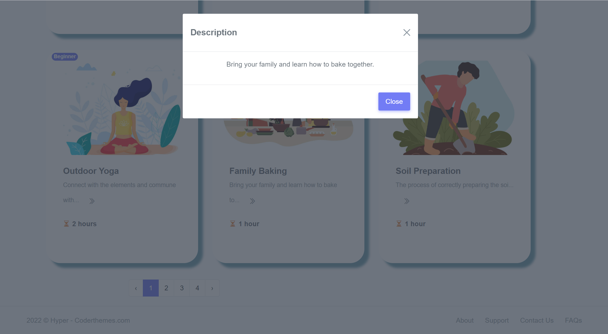

# Trainsquare

Trainsquare is a social networking platform that allows users to host their own in-person workshops, as well as discover and book courses, lessons and activities within their communities.

This repo contains sql, .net, and react code pertaining to the lessons feature I was personally responsible for designing and building.

  

  

  

  

  

  

